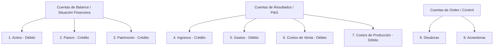
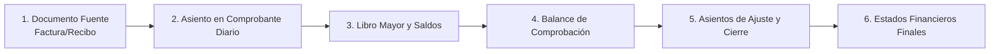

# Fundamentos de Contabilidad Básica y Estándar Financiero

Esta skill contiene el conocimiento fundamental, principios matemáticos, dinámicas de cuentas y reglas de negocio contables indispensables para diseñar, implementar, auditar o validar módulos financieros, motores de asientos contables y reportes en el sistema.

---

## 🏛️ 1. Principios Fundamentales y Ecuación Contable

### 1.1. La Ecuación Contable Fundamental
Toda la contabilidad descansa sobre la igualdad financiera del patrimonio:

$$\text{Activo} = \text{Pasivo} + \text{Patrimonio}$$

* **Activo:** Recursos, bienes y derechos económicos controlados por la entidad (dinero en caja/bancos, cuentas por cobrar, inventarios, activos fijos).
* **Pasivo:** Obligaciones, deudas y compromisos presentes contraídos por la entidad (cuentas por pagar a proveedores, préstamos bancarios, impuestos por pagar).
* **Patrimonio (Capital/Patrimonio Neto):** La participación residual en los activos de la entidad una vez deducidos todos sus pasivos (aportes de socios, utilidades acumuladas, reservas).

### 1.2. Ecuación Contable Ampliada (Dinámica Operativa)
Al incorporar las operaciones de ingresos, costos y gastos en un periodo determinado:

$$\text{Activo} + \text{Gastos} + \text{Costos} = \text{Pasivo} + \text{Patrimonio} + \text{Ingresos}$$

---

## ⚖️ 2. Principio de Partida Doble y Dinámica de Cuentas

### 2.1. Regla de Oro de la Partida Doble
* **"No hay deudor sin acreedor, ni acreedor sin deudor"**.
* En cualquier transacción o comprobante contable, la suma de los Débitos debe ser idéntica a la suma de los Créditos:

$$\sum \text{Débitos} = \sum \text{Créditos}$$

### 2.2. Débito (Debe) vs Crédito (Haber)
* **Débito (Debe / Cargar / Debitar):** Columna izquierda. Representa incrementos en activos, gastos o costos; o disminuciones en pasivos, patrimonio o ingresos.
* **Crédito (Haber / Abonar / Acreditar):** Columna derecha. Representa incrementos en pasivos, patrimonio o ingresos; o disminuciones en activos, gastos o costos.

### 2.3. Matriz de Naturaleza de Cuentas

| Tipo de Cuenta | Naturaleza Habitual | Aumenta con | Disminuye con | Saldo Típico |
| :--- | :--- | :--- | :--- | :--- |
| **1. Activo** | **Débito** | Débito (Debe) | Crédito (Haber) | Débito |
| **2. Pasivo** | **Crédito** | Crédito (Haber) | Débito (Debe) | Crédito |
| **3. Patrimonio** | **Crédito** | Crédito (Haber) | Débito (Debe) | Crédito |
| **4. Ingresos** | **Crédito** | Crédito (Haber) | Débito (Debe) | Crédito |
| **5. Gastos** | **Débito** | Débito (Debe) | Crédito (Haber) | Débito |
| **6. Costos de Ventas** | **Débito** | Débito (Debe) | Crédito (Haber) | Débito |
| **7. Costos de Producción** | **Débito** | Débito (Debe) | Crédito (Haber) | Débito |

---

## 🗂️ 3. Estructura del Plan Único de Cuentas (PUC / NIIF)

La codificación contable estándar se organiza de forma jerárquica:
* **Dígito 1:** Clase (ej. `1` Activo)
* **Dígitos 1-2:** Grupo (ej. `11` Disponible / Efectivo)
* **Dígitos 1-4:** Cuenta (ej. `1105` Caja)
* **Dígitos 1-6:** Subcuenta (ej. `110505` Caja General)
* **Dígitos 1-8+:** Cuenta Auxiliar / Tercero (ej. `11050501` Caja Principal Sede 1)

### Clases Principales (PUC Comercial / Estándar Latinoamericano):

### Cuentas Clave de Uso Frecuente:
* **`1105` Caja / `1110` Bancos:** Efectivo y equivalentes de efectivo.
* **`1305` Clientes (Cuentas por Cobrar Comerciales):** Derechos de cobro por ventas a crédito.
* **`1365` Anticipo de Impuestos (Retención en la Fuente a Favor):** Retenciones practicadas que generan derecho de crédito con el fisco.
* **`1435` Mercancías no fabricadas por la empresa:** Inventario disponible para la venta.
* **`2205` Proveedores Nacionales:** Obligaciones por compra de mercancía a crédito.
* **`2335` Costos y Gastos por Pagar:** Pasivos por servicios públicos, arriendos, honorarios.
* **`2365` Retención en la Fuente (Pasivo):** Retenciones practicadas a terceros pendientes de pago a la DIAN/Hacienda.
* **`2408` Impuesto sobre las Ventas por Pagar (IVA):**
  - `240801` IVA Generado (en ventas - Crédito).
  - `240802` IVA Descontable (en compras gravadas - Débito).
* **`4135` Comercio al por mayor y al por menor:** Ingresos operacionales por venta de productos.
* **`4905` Diferencia en Cambio / Redondeo (Ingresos):** Ajustes por redondeos en operaciones.
* **`5105` / `5205` Gastos de Personal (Administración / Ventas):** Sueldos, cesantías, seguridad social.
* **`5905` Diferencia en Cambio / Redondeo (Gastos):** Ajustes y pérdidas por redondeo.
* **`6135` Costo de Ventas:** Valor de adquisición del inventario que fue vendido.

---

## 🔄 4. El Ciclo Contable Completo

1. **Documentos Fuente:** Facturas electrónicas, recibos de caja (ingresos), comprobantes de egreso (pagos), notas crédito/débito, remisiones.
2. **Libro Diario (Journal):** Registro cronológico de transacciones mediante asientos contables detallados.
3. **Libro Mayor (General Ledger):** Agrupación y acumulación de movimientos por cada código de cuenta contable.
4. **Balance de Comprobación (Trial Balance):** Verificación de sumas iguales ($\sum Débito = \sum Crédito$) de todas las cuentas activas en el periodo.
5. **Ajustes y Cierre Contable:**
   - Amortizaciones y depreciaciones de activos fijos.
   - Deterioro de cartera (cuentas de difícil cobro).
   - Cancelación de cuentas de resultado (Clases 4, 5, 6, 7) contra la cuenta `5905 Diferencia en Cambio / Resultados` para determinar la utilidad o pérdida del ejercicio y transferirla al Patrimonio (`3605` Utilidad del Ejercicio o `3610` Pérdida del Ejercicio).
6. **Emisión de Estados Financieros:** Generación de reportes bajo estándares internacionales (NIIF / IFRS).

---

## 📊 5. Estados Financieros Principales

### 5.1. Estado de Situación Financiera (Balance General)
* **Objetivo:** Muestra la "foto" estática de la salud patrimonial de la empresa a una fecha de corte determinada.
* **Estructura:**
  $$\text{Activo Total} = \text{Pasivo Total} + \text{Patrimonio Total}$$

### 5.2. Estado de Resultados Integral (Pérdidas y Ganancias / P&G)
* **Objetivo:** Muestra el rendimiento económico y la rentabilidad durante un periodo específico.
* **Esquema de Cálculo:**
  $$\text{Ingresos Operacionales (Ventas)}$$
  $$- \text{Costo de Ventas}$$
  $$= \mathbf{\text{Utilidad Bruta}}$$
  $$- \text{Gastos de Administración y Ventas (Operacionales)}$$
  $$= \mathbf{\text{Utilidad Operacional (EBIT)}}$$
  $$+ \text{Ingresos No Operacionales} - \text{Gastos Financieros / No Operacionales}$$
  $$= \mathbf{\text{Utilidad Antes de Impuestos}}$$
  $$- \text{Impuesto sobre la Renta}$$
  $$= \mathbf{\text{Utilidad Neta del Ejercicio}}$$

### 5.3. Estado de Flujos de Efectivo
* Clasifica las entradas y salidas reales de dinero en tres actividades:
  1. **Actividades de Operación:** Cobros a clientes, pagos a proveedores, salarios, impuestos.
  2. **Actividades de Inversión:** Compra o venta de activos fijos, maquinaria, inversiones.
  3. **Actividades de Financiación:** Aportes de capital, desembolsos o pagos de capital de créditos bancarios, pago de dividendos.

---

## 🧾 6. Impuestos, Retenciones e IVA en el Ámbito Comercial

### 6.1. IVA (Impuesto al Valor Agregado)

#### IVA Generado vs IVA Descontable
* **IVA Generado (`240801` - Crédito):** Se cobra al cliente en la venta de bienes/servicios gravados. Es un pasivo que la empresa debe entregar al fisco.
* **IVA Descontable (`240802` - Débito):** Se paga a los proveedores en las compras de bienes/servicios gravados. Reduce la deuda con el fisco.

#### Gastos NO Deducibles de IVA
El IVA descontable **NO aplica** a:
- Adquisición de bienes/servicios exentos de IVA (alimentos básicos, medicinas, algunos servicios de salud)
- Gastos de representación y entretenimiento personal
- Multas, sanciones e impuestos sobre la renta
- Combustible para vehículos personales
- Comidas y bebidas no relacionadas directamente con actividad comercial

#### Liquidación del IVA
$$\text{IVA a Pagar} = \text{IVA Generado} - \text{IVA Descontable}$$

Si el resultado es negativo, hay un **saldo a favor** que puede:
- Trasladarse al siguiente período
- Solicitarse reembolso ante la Hacienda (DIAN)
- Compensarse contra otros impuestos

---

### 6.2. Retención en la Fuente

* No es un impuesto nuevo, sino un mecanismo de recaudo anticipado de impuestos (Renta, IVA, ICA).

#### Roles en la Retención:
* **Agente Retenedor (Quien compra/contrata):**
  - Practica la retención, descuenta ese valor del pago al proveedor
  - Registra la retención como **Pasivo** (`2365` Retención en la fuente por pagar)
  - Debe declarar y enterarla a la autoridad fiscal en las fechas programadas

* **Contribuyente Retenido (Quien vende/presta servicio):**
  - Sufre la retención practicada
  - Registra la retención como **Activo** (`1365` Anticipo de Impuestos - Retención en la fuente a favor)
  - Descuenta el valor del impuesto en su declaración de renta

#### Tarifas Comunes de Retención en Colombia:
| Concepto | Tarifa | Ejemplo |
| :--- | :--- | :--- |
| Compra de bienes | 2.5% | Compra de inventario |
| Servicios técnicos/profesionales | 10% | Honorarios a abogados, contadores |
| Transporte de carga | 2.5% | Fletes nacionales |
| Arrendamiento | 3.5% | Pago de arriendo comercial |
| Comisiones | 3% - 5% | Comisiones por ventas |

---

## 💼 7. Cuentas de Orden (Clase 8 y 9)

### 7.1. Qué son las Cuentas de Orden
Las cuentas de orden son cuentas de **control y contingencia** que registran información económica o de compromisos que no afectan directamente el balance de comprobación (no forman parte de la ecuación contable). Se usan para:
- Seguimiento de compromisos contingentes
- Garantías y avales
- Mercancías en depósito o custodia
- Bienes totalmente depreciados pero en uso
- Compromisos de compra/venta no completados

### 7.2. Clasificación

| Clase | Naturaleza | Uso | Ejemplo |
| :--- | :--- | :--- | :--- |
| **8. Deudoras** | Débito | Activos contingentes, promesas de pago, compromisos de compra | Garantías recibidas, avales a favor de la empresa |
| **9. Acreedoras** | Crédito | Pasivos contingentes, obligaciones condicionales | Garantías otorgadas, avales contra la empresa, mercancías en consignación |

### 7.3. Ejemplos Prácticos

**Ejemplo A: Garantía Bancaria Recibida (Cuenta 8)**
- La empresa recibe del banco una garantía de cumplimiento de contrato por \$5.000.000
  - **Débito `810505` - Garantías recibidas:** \$5.000.000
  - **Crédito `910505` - Garantías otorgadas (contrapartida):** \$5.000.000
- Al completarse la obligación o vencer la garantía, se cancela el asiento

**Ejemplo B: Mercancías Recibidas en Consignación (Cuenta 9)**
- Recibe 1.000 unidades de producto en consignación (no pagadas, solo se venden)
  - **Débito `810510` - Mercancías en consignación (recibidas):** Valor de mercado
  - **Crédito `910510` - Mercancías en consignación (enviadas):** Valor de mercado
- Se cancela cuando se devuelven o se formalizan las compras

---

## 📝 8. Ejemplos Prácticos de Asientos Contables Típicos

### Ejemplo 1: Compra de Mercancía a Crédito con IVA y Retención en la Fuente
* **Escenario:** Compra de inventario por \$1.000.000 + IVA 19% (\$190.000), Retención en la fuente 2.5% (\$25.000). Total a pagar a Proveedores = \$1.165.000.

| Cuenta PUC | Nombre de Cuenta | Débito | Crédito |
| :--- | :--- | :--- | :--- |
| `143505` | Mercancías no fabricadas (Inventario) | \$1.000.000 | \$0 |
| `240802` | IVA Descontable (19%) | \$190.000 | \$0 |
| `236540` | Retención en la fuente por compras (2.5%) | \$0 | \$25.000 |
| `220505` | Proveedores Nacionales | \$0 | \$1.165.000 |
| **TOTALES** | **Sumas Iguales** | **\$1.190.000** | **\$1.190.000** |

---

### Ejemplo 2: Venta de Mercancía de Contado (Con registro simultáneo del Costo de Ventas)
* **Escenario:** Venta de \$500.000 + IVA 19% (\$95.000) recibidos en Banco. El costo de adquisición de dicha mercancía fue de \$300.000.

**Paso A: Registro del Ingreso y Recaudo:**
| Cuenta PUC | Nombre de Cuenta | Débito | Crédito |
| :--- | :--- | :--- | :--- |
| `111005` | Bancos (Cuenta Corriente / Ahorros) | \$595.000 | \$0 |
| `413505` | Comercio al por mayor y menor (Ingreso) | \$0 | \$500.000 |
| `240801` | IVA Generado (19%) | \$0 | \$95.000 |
| **SUBTOTAL A** | **Sumas Iguales** | **\$595.000** | **\$595.000** |

**Paso B: Registro de la Salida de Inventario (Costo de Ventas):**
| Cuenta PUC | Nombre de Cuenta | Débito | Crédito |
| :--- | :--- | :--- | :--- |
| `613505` | Costo de Ventas (Comercio) | \$300.000 | \$0 |
| `143505` | Mercancías no fabricadas (Salida inventario) | \$0 | \$300.000 |
| **SUBTOTAL B** | **Sumas Iguales** | **\$300.000** | **\$300.000** |

---

### Ejemplo 3: Pago de Factura de Proveedor con Transferencia Bancaria
* **Escenario:** Se paga la cuenta pendiente al proveedor por \$1.165.000 desde la cuenta de banco.

| Cuenta PUC | Nombre de Cuenta | Débito | Crédito |
| :--- | :--- | :--- | :--- |
| `220505` | Proveedores Nacionales (Disminución pasivo) | \$1.165.000 | \$0 |
| `111005` | Bancos (Disminución activo) | \$0 | \$1.165.000 |
| **TOTALES** | **Sumas Iguales** | **\$1.165.000** | **\$1.165.000** |

---

### Ejemplo 4: Redondeo por Diferencia de Centavos
* **Escenario:** Al conciliar banco, aparece una diferencia de \$0.37 por redondeo de cambio. Se debe ajustar.

**Opción A: Si la diferencia es a favor de la empresa (ganancia):**
| Cuenta PUC | Nombre de Cuenta | Débito | Crédito |
| :--- | :--- | :--- | :--- |
| `111005` | Bancos | \$0.37 | \$0 |
| `4905` | Diferencia en Cambio / Redondeo (Ingreso) | \$0 | \$0.37 |

**Opción B: Si la diferencia es en contra (pérdida):**
| Cuenta PUC | Nombre de Cuenta | Débito | Crédito |
| :--- | :--- | :--- | :--- |
| `5905` | Diferencia en Cambio / Redondeo (Gasto) | \$0.37 | \$0 |
| `111005` | Bancos | \$0 | \$0.37 |

---

### Ejemplo 5: Cierre de Período (Cancelación de Cuentas de Resultado)
* **Escenario:** Al cierre del período contable, se cierra el resultado operacional. Supongamos:
  - Ingresos totales: \$5.000.000
  - Costos y Gastos totales: \$3.500.000
  - Resultado del período: \$1.500.000 (Ganancia)

**Paso A: Cancelar Ingresos (Clase 4) contra Resultados:**
| Cuenta PUC | Nombre de Cuenta | Débito | Crédito |
| :--- | :--- | :--- | :--- |
| `413505` | Ingresos por Ventas (Cierre) | \$5.000.000 | \$0 |
| `5905` | Resultados del Ejercicio (Acreedor) | \$0 | \$5.000.000 |

**Paso B: Cancelar Costos y Gastos (Clases 5, 6, 7) contra Resultados:**
| Cuenta PUC | Nombre de Cuenta | Débito | Crédito |
| :--- | :--- | :--- | :--- |
| `5905` | Resultados del Ejercicio (Deudor) | \$3.500.000 | \$0 |
| `613505` | Costo de Ventas (Cierre) | \$0 | \$2.000.000 |
| `511005` | Gastos de Administración (Cierre) | \$0 | \$1.500.000 |

**Saldo de Resultados:** \$5.000.000 - \$3.500.000 = \$1.500.000 (Crédito = Ganancia)

**Paso C: Transferir Resultado a Patrimonio:**
| Cuenta PUC | Nombre de Cuenta | Débito | Crédito |
| :--- | :--- | :--- | :--- |
| `5905` | Resultados del Ejercicio (Saldo final) | \$1.500.000 | \$0 |
| `3605` | Utilidad del Ejercicio (Patrimonio) | \$0 | \$1.500.000 |

---

### Ejemplo 6: Anulación de Comprobante (Asiento de Reversión)
* **Escenario:** Se registró mal una compra por \$500.000 a proveedor X; se debe reversar y contabilizar correctamente.

**Paso A: Crear Asiento de Reversión (Invertir débitos y créditos):**
| Cuenta PUC | Nombre de Cuenta | Débito | Crédito | Referencia |
| :--- | :--- | :--- | :--- | :--- |
| `220505` | Proveedores Nacionales | \$500.000 | \$0 | Reverso de comprobante errado |
| `143505` | Mercancías no fabricadas | \$0 | \$500.000 | Reverso de comprobante errado |

**Paso B: Contabilizar Correctamente (Nueva operación):**
| Cuenta PUC | Nombre de Cuenta | Débito | Crédito | Referencia |
| :--- | :--- | :--- | :--- | :--- |
| `143505` | Mercancías no fabricadas | \$500.000 | \$0 | Registro correcto |
| `220505` | Proveedores Nacionales | \$0 | \$500.000 | Registro correcto |

---

## 💻 9. Directivas Obligatorias para Software y Motores Contables

Al implementar o modificar lógica de negocio, endpoints, servicios o bases de datos contables:

### 9.1. Garantía Incondicional de Balanceo (Sumas Iguales)
* Ningún comprobante o asiento contable debe guardarse en la base de datos si:
  $$\left|\sum \text{Débitos} - \sum \text{Créditos}\right| > 0.01$$
* Redondeos de centavos debe manejarse automáticamente con cuentas de ajuste autorizadas (`4905` o `5905`).
* **Validación en Backend:** Siempre validar sumas ANTES de persistir en BD, nunca confiar en validaciones frontend.

### 9.2. Inmutabilidad y Auditoría
* Los asientos contables asentados/contabilizados **NO deben eliminarse** físicamente (`DELETE`). Cualquier corrección debe realizarse mediante:
  - **Asiento de Reversión:** Invierte débitos y créditos del asiento original
  - **Asiento de Ajuste:** Registra el corrección adicional
  - **Asiento de Anulación:** Marca el comprobante como anulado, pero mantiene el registro histórico
* **Campos de Auditoría Obligatorios** en toda transacción contable:
  - `fechaCreacion` (timestamp de creación)
  - `usuarioId` (quién registró)
  - `documentoReferencia` (factura, remisión, recibo, etc.)
  - `terceroId` (proveedor, cliente o empleado asociado)
  - `centroCostos` (para análisis por línea de negocio)
  - `estadoComprobante` (Borrador, Contabilizado, Anulado)
  - `fechaAnulacion` y `motivoAnulacion` (si aplica)

### 9.3. Manejo de Decimales
* **Tipos de Datos en BD:**
  - Utilizar `DECIMAL(14, 2)` o `NUMERIC(14, 2)` para valores monetarios
  - Evitar tipos `FLOAT` o `DOUBLE` que pierden precisión en operaciones
* **Backend (Node.js / JavaScript):**
  - Usar librerías como `decimal.js` o `big.js` para operaciones exactas
  - NUNCA usar operaciones directas de punto flotante para cálculos contables
* **Frontend:**
  - Formatear valores con máximo 2 decimales para visualización
  - Validar entrada de moneda antes de enviar al servidor

### 9.4. Cierres de Período
* **Impedir modificaciones en períodos cerrados:**
  - Bloquear creación, edición o eliminación de comprobantes en períodos marcados como "Cerrados"
  - Mantener registro de fecha de cierre y usuario que cierra
* **Proceso de Cierre Obligatorio:**
  1. Generar balance de comprobación
  2. Registrar asientos de ajuste (depreciación, deterioro, etc.)
  3. Generar estados financieros
  4. Cancelación de cuentas de resultado
  5. Marcar período como cerrado (cambiar flag `periodoCerrado = true`)
* **Reapertura (si es necesaria):**
  - Requerir autorización de supervisor/contador
  - Registrar usuario, fecha y motivo de reapertura
  - Reversionar asientos de cierre automáticamente

### 9.5. Validación de Integridad de Datos
* **Reglas de Negocio en BD:**
  - Constraint de unicidad en `(comprobante_id, cuenta_id, tercero_id)` por período para evitar duplicados
  - Foreign keys hacia tabla de Cuentas (validar que `cuenta_id` existe)
  - Foreign keys hacia tabla de Terceros (validar que `tercero_id` existe)
* **Índices Recomendados:**
  - `(fecha, estado)` para búsquedas rápidas por período
  - `(cuenta_id, fecha)` para reportes por cuenta
  - `(tercero_id, fecha)` para seguimiento de clientes/proveedores

### 9.6. Reportes y Exportación Segura
* **Auditoría de Exportaciones:**
  - Registrar quién, cuándo y qué datos exportó
  - Restringir exportaciones a usuarios con permisos contables
* **Formatos:**
  - XML para integración con autoridades fiscales
  - CSV para Excel (con encoding UTF-8)
  - PDF firmado digitalmente para reportes oficiales
* **Integridad de Reportes:**
  - Incluir siempre hash/firma de los datos para detectar manipulación posterior

---

## 📚 Referencia Rápida: Abreviaturas y Términos

| Término | Significado |
| :--- | :--- |
| **PUC** | Plan Único de Cuentas |
| **NIIF / IFRS** | Normas Internacionales de Información Financiera |
| **IVA** | Impuesto al Valor Agregado |
| **DIAN** | Dirección de Impuestos y Aduanas Nacionales (Colombia) |
| **EBIT** | Earnings Before Interest and Taxes (Ganancia Operacional) |
| **P&G** | Pérdidas y Ganancias (Estado de Resultados) |
| **RUC** | Registro Único del Contribuyente |
| **Retefuente** | Retención en la Fuente (mecanismo fiscal) |
| **Tercero** | Cliente, proveedor, empleado o cualquier parte relacionada |

---

## 🎯 Sumario de Validación para Auditar Software Contable

**Checklist antes de liberar a producción:**

- [ ] Todos los asientos balancean (Débitos = Créditos)
- [ ] Las transacciones se registran inmutablemente (no hay DELETE)
- [ ] Los campos de auditoría están completos (usuario, fecha, documento, tercero)
- [ ] IVA descontable solo aplica a compras de bienes/servicios gravados
- [ ] Retención en la fuente se registra en cuentas correctas (2365 o 1365)
- [ ] Cierre de período impide registros en períodos pasados
- [ ] Estados financieros se generan automáticamente desde saldos de Mayor
- [ ] Redondeos se contabilizan en cuentas autorizadas (4905 o 5905)
- [ ] Decimales se manejan con DECIMAL(14,2) en BD
- [ ] Existe trail de auditoría completo (quién, qué, cuándo, dónde)
