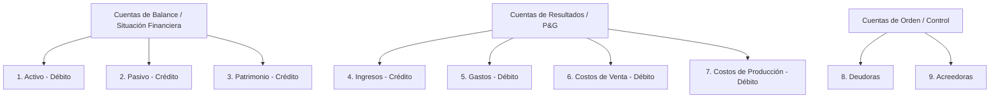
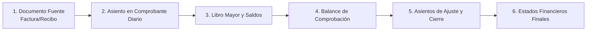

# Fundamentos de Contabilidad Básica y Estándar Financiero

Esta skill contiene el conocimiento fundamental, principios matemáticos, dinámicas de cuentas y reglas de negocio contables indispensables para diseñar, implementar, auditar o validar módulos financieros, motores de asientos contables y reportes en el sistema.

---

## 🏛️ 1. Principios Fundamentales y Ecuación Contable

### 1.1. La Ecuación Contable Fundamental
Toda la contabilidad descansa sobre la igualdad financiera del patrimonio:

$$\text{Activo} = \text{Pasivo} + \text{Patrimonio}$$

* **Activo:** Recursos, bienes y derechos económicos controlados por la entidad (dinero en caja/bancos, cuentas por cobrar, inventarios, activos fijos).
* **Pasivo:** Obligaciones, deudas y compromisos presentes contraídos por la entidad (cuentas por pagar a proveedores, préstamos bancarios, impuestos por pagar).
* **Patrimonio (Capital/Patrimonio Neto):** La participación residual en los activos de la entidad una vez deducidos todos sus pasivos (aportes de socios, utilidades acumuladas, reservas).

### 1.2. Ecuación Contable Ampliada (Dinámica Operativa)
Al incorporar las operaciones de ingresos, costos y gastos en un periodo determinado:

$$\text{Activo} + \text{Gastos} + \text{Costos} = \text{Pasivo} + \text{Patrimonio} + \text{Ingresos}$$

---

## ⚖️ 2. Principio de Partida Doble y Dinámica de Cuentas

### 2.1. Regla de Oro de la Partida Doble
* **"No hay deudor sin acreedor, ni acreedor sin deudor"**.
* En cualquier transacción o comprobante contable, la suma de los Débitos debe ser idéntica a la suma de los Créditos:

$$\sum \text{D\u00e9bitos} = \sum \text{Cr\u00e9ditos}$$

### 2.2. Débito (Debe) vs Crédito (Haber)
* **Débito (Debe / Cargar / Debitar):** Columna izquierda. Representa incrementos en activos, gastos o costos; o disminuciones en pasivos, patrimonio o ingresos.
* **Crédito (Haber / Abonar / Acreditar):** Columna derecha. Representa incrementos en pasivos, patrimonio o ingresos; o disminuciones en activos, gastos o costos.

### 2.3. Matriz de Naturaleza de Cuentas

| Tipo de Cuenta | Naturaleza Habitual | Aumenta con | Disminuye con | Saldo Típico |
| :--- | :--- | :--- | :--- | :--- |
| **1. Activo** | **Débito** | Débito (Debe) | Crédito (Haber) | Débito |
| **2. Pasivo** | **Crédito** | Crédito (Haber) | Débito (Debe) | Crédito |
| **3. Patrimonio** | **Crédito** | Crédito (Haber) | Débito (Debe) | Crédito |
| **4. Ingresos** | **Crédito** | Crédito (Haber) | Débito (Debe) | Crédito |
| **5. Gastos** | **Débito** | Débito (Debe) | Crédito (Haber) | Débito |
| **6. Costos de Ventas** | **Débito** | Débito (Debe) | Crédito (Haber) | Débito |
| **7. Costos de Producción** | **Débito** | Débito (Debe) | Crédito (Haber) | Débito |

---

## 🗂️ 3. Estructura del Plan Único de Cuentas (PUC / NIIF)

La codificación contable estándar se organiza de forma jerárquica:
* **Dígito 1:** Clase (ej. `1` Activo)
* **Dígitos 1-2:** Grupo (ej. `11` Disponible / Efectivo)
* **Dígitos 1-4:** Cuenta (ej. `1105` Caja)
* **Dígitos 1-6:** Subcuenta (ej. `110505` Caja General)
* **Dígitos 1-8+:** Cuenta Auxiliar / Tercero (ej. `11050501` Caja Principal Sede 1)

### Clases Principales (PUC Comercial / Estándar Latinoamericano):

### Cuentas Clave de Uso Frecuente:
* **`1105` Caja / `1110` Bancos:** Efectivo y equivalentes de efectivo.
* **`1305` Clientes (Cuentas por Cobrar Comerciales):** Derechos de cobro por ventas a crédito.
* **`1435` Mercancías no fabricadas por la empresa:** Inventario disponible para la venta.
* **`2205` Proveedores Nacionales:** Obligaciones por compra de mercancía a crédito.
* **`2335` Costos y Gastos por Pagar:** Pasivos por servicios públicos, arriendos, honorarios.
* **`2365` Retención en la Fuente (Pasivo):** Retenciones practicadas a terceros pendientes de pago a la DIAN/Hacienda.
* **`2408` Impuesto sobre las Ventas por Pagar (IVA):**
  - `240801` IVA Generado (en ventas - Crédito).
  - `240802` IVA Descontable (en compras - Débito).
* **`4135` Comercio al por mayor y al por menor:** Ingresos operacionales por venta de productos.
* **`5105` / `5205` Gastos de Personal (Administración / Ventas):** Sueldos, cesantías, seguridad social.
* **`6135` Costo de Ventas:** Valor de adquisición del inventario que fue vendido.

---

## 🔄 4. El Ciclo Contable Completo

1. **Documentos Fuente:** Facturas electrónicas, recibos de caja (ingresos), comprobantes de egreso (pagos), notas crédito/débito, remisiones.
2. **Libro Diario (Journal):** Registro cronológico de transacciones mediante asientos contables detallados.
3. **Libro Mayor (General Ledger):** Agrupación y acumulación de movimientos por cada código de cuenta contable.
4. **Balance de Comprobación (Trial Balance):** Verificación de sumas iguales ($\sum Débito = \sum Crédito$) de todas las cuentas activas en el periodo.
5. **Ajustes y Cierre Contable:**
   - Amortizaciones y depreciaciones de activos fijos.
   - Deterioro de cartera (cuentas de difícil cobro).
   - Cancelación de cuentas de resultado (Clases 4, 5, 6) contra la cuenta `5905 Ganancias y Pérdidas` para determinar la utilidad o pérdida del ejercicio y transferirla al Patrimonio (`3605` Utilidad del Ejercicio o `3610` Pérdida).
6. **Emisión de Estados Financieros:** Generación de reportes bajo estándares internacionales (NIIF / IFRS).

---

## 📊 5. Estados Financieros Principales

### 5.1. Estado de Situación Financiera (Balance General)
* **Objetivo:** Muestra la "foto" estática de la salud patrimonial de la empresa a una fecha de corte determinada.
* **Estructura:**
  $$\text{Activo Total} = \text{Pasivo Total} + \text{Patrimonio Total}$$

### 5.2. Estado de Resultados Integral (Pérdidas y Ganancias / P&G)
* **Objetivo:** Muestra el rendimiento económico y la rentabilidad durante un periodo específico.
* **Esquema de Cálculo:**
  $$\text{Ingresos Operacionales (Ventas)}$$
  $$- \text{Costo de Ventas}$$
  $$= \mathbf{\text{Utilidad Bruta}}$$
  $$- \text{Gastos de Administraci\u00f3n y Ventas (Operacionales)}$$
  $$= \mathbf{\text{Utilidad Operacional (EBIT)}}$$
  $$+ \text{Ingresos No Operacionales} - \text{Gastos Financieros / No Operacionales}$$
  $$= \mathbf{\text{Utilidad Antes de Impuestos}}$$
  $$- \text{Impuesto sobre la Renta}$$
  $$= \mathbf{\text{Utilidad Neta del Ejercicio}}$$

### 5.3. Estado de Flujos de Efectivo
* Clasifica las entradas y salidas reales de dinero en tres actividades:
  1. **Actividades de Operación:** Cobros a clientes, pagos a proveedores, salarios, impuestos.
  2. **Actividades de Inversión:** Compra o venta de activos fijos, maquinaria, inversiones.
  3. **Actividades de Financiación:** Aportes de capital, desembolsos o pagos de capital de créditos bancarios, pago de dividendos.

---

## 🧾 6. Impuestos, Retenciones e IVA en el Ámbito Comercial

### 6.1. IVA (Impuesto al Valor Agregado)
* **IVA Generado (Crédito - `240801`):** Se cobra al cliente en la venta. Es un pasivo que la empresa debe entregar al fisco.
* **IVA Descontable (Débito - `240802`):** Se paga a los proveedores en las compras de bienes/servicios gravados. Disminuye la deuda con el fisco.
* **Liquidación del IVA:**
  $$\text{IVA a Pagar} = \text{IVA Generado} - \text{IVA Descontable}$$

### 6.2. Retención en la Fuente
* No es un impuesto nuevo, sino un mecanismo de recaudo anticipado de impuestos (Renta, IVA, ICA).
* **Quien compra (Agente Retenedor):** Practica la retención, descuenta ese valor del pago al proveedor y lo registra como un Pasivo (`2365` Retención en la fuente por pagar).
* **Quien vende:** Sufre la retención y la registra como un Activo (`1355` Anticipo de impuestos / Retención a favor).

---

## 📝 7. Ejemplos Prácticos de Asientos Contables Típicos

### Ejemplo 1: Compra de Mercancía a Crédito con IVA y Retención en la Fuente
* **Escenario:** Compra de inventario por \$1.000.000 + IVA 19% (\$190.000), Retefuente 2.5% (\$25.000). Total a pagar a Proveedores = \$1.165.000.

| Cuenta PUC | Nombre de Cuenta | Débito | Crédito |
| :--- | :--- | :--- | :--- |
| `143505` | Mercancías no fabricadas (Inventario) | \$1.000.000 | \$0 |
| `240802` | IVA Descontable (19%) | \$190.000 | \$0 |
| `236540` | Retención en la fuente por compras (2.5%) | \$0 | \$25.000 |
| `220505` | Proveedores Nacionales | \$0 | \$1.165.000 |
| **TOTALES** | **Sumas Iguales** | **\$1.190.000** | **\$1.190.000** |

---

### Ejemplo 2: Venta de Mercancía de Contado (Con registro simultáneo del Costo de Ventas)
* **Escenario:** Venta de \$500.000 + IVA 19% (\$95.000) recibidos en Banco. El costo de adquisición de dicha mercancía fue de \$300.000.

**Paso A: Registro del Ingreso y Recaudo:**
| Cuenta PUC | Nombre de Cuenta | Débito | Crédito |
| :--- | :--- | :--- | :--- |
| `111005` | Bancos (Cuenta Corriente / Ahorros) | \$595.000 | \$0 |
| `413505` | Comercio al por mayor y menor (Ingreso) | \$0 | \$500.000 |
| `240801` | IVA Generado (19%) | \$0 | \$95.000 |
| **SUBTOTAL A** | **Sumas Iguales** | **\$595.000** | **\$595.000** |

**Paso B: Registro de la Salida de Inventario (Costo de Ventas):**
| Cuenta PUC | Nombre de Cuenta | Débito | Crédito |
| :--- | :--- | :--- | :--- |
| `613505` | Costo de Ventas (Comercio) | \$300.000 | \$0 |
| `143505` | Mercancías no fabricadas (Salida inventario) | \$0 | \$300.000 |
| **SUBTOTAL B** | **Sumas Iguales** | **\$300.000** | **\$300.000** |

---

### Ejemplo 3: Pago de Factura de Proveedor con Transferencia Bancaria
* **Escenario:** Se paga la cuenta pendiente al proveedor por \$1.165.000 desde la cuenta de banco.

| Cuenta PUC | Nombre de Cuenta | Débito | Crédito |
| :--- | :--- | :--- | :--- |
| `220505` | Proveedores Nacionales (Disminución pasivo) | \$1.165.000 | \$0 |
| `111005` | Bancos (Disminución activo) | \$0 | \$1.165.000 |
| **TOTALES** | **Sumas Iguales** | **\$1.165.000** | **\$1.165.000** |

---

## 💻 8. Directivas Obligatorias para Software y Motores Contables

Al implementar o modificar lógica de negocio, endpoints, servicios o bases de datos contables:

1. **Garantía Incondicional de Balanceo (Sumas Iguales):**
   - Ningún comprobante o asiento contable debe guardarse en la base de datos si $\left|\sum \text{Débitos} - \sum \text{Créditos}\right| > 0.01$.
   - Redondeos de centavos deben manejarse con cuentas de ajuste por diferencia en cambio o redondeo autorizado.
2. **Inmutabilidad y Auditoría:**
   - Los asientos contables asentados/contabilizados no deben eliminarse físicamente (`DELETE`). Cualquier corrección debe realizarse mediante **Asiento de Reversión / Anulación / Ajuste**.
   - Registrar siempre: `fechaCreacion`, `usuarioId`, `documentoReferencia`, `terceroId`, `centroCostos`.
3. **Manejo de Decimales:**
   - Utilizar tipos de datos numéricos exactos en Base de Datos (`DECIMAL(14, 2)` o `NUMERIC`) y evitar pérdida de precisión de punto flotante de JavaScript en el Backend.
4. **Cierres de Periodo:**
   - Impedir la creación o modificación de comprobantes en fechas correspondientes a periodos contables marcados como "Cerrados".
