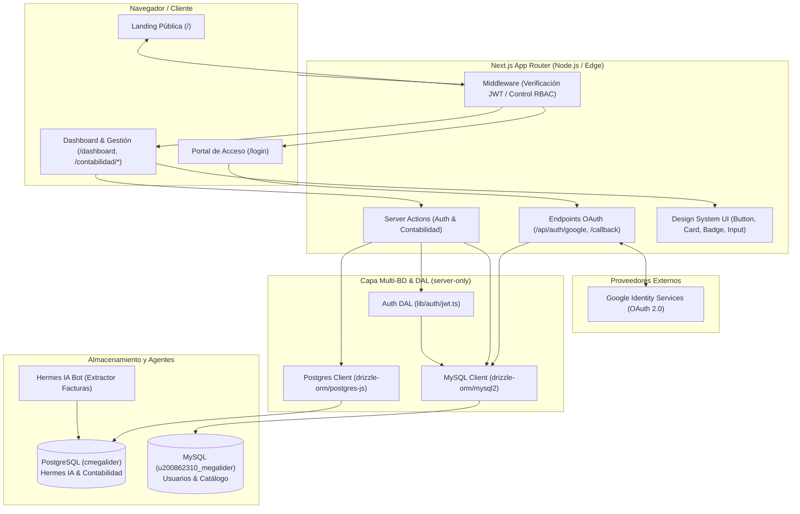

# 🏛️ 01 - Arquitectura General del Sistema

El sistema **Cigarrería Megalider** adopta una arquitectura desacoplada por capas basada en Next.js 16+ App Router, con renderizado híbrido (SSR / Client Components) y acceso a múltiples bases de datos relacionales mediante Drizzle ORM.

---

## 🏛️ Diagrama de Arquitectura de Capas

---

## 🗄️ Estrategia Multi-Base de Datos

1. **PostgreSQL (`cmegalider`):**
   - **Propósito:** Almacenar la contabilidad de la empresa, facturas de compras de mercancía (desglose de IVA, Impoconsumo, CUFE), egresos de caja registrados por el bot **Hermes IA** y la tabla de auditoría `historial_correcciones`.
   - **ORM Driver:** `drizzle-orm/postgres-js` utilizando la biblioteca `postgres`.

2. **MySQL (`u200862310_megalider`):**
   - **Propósito:** Gestionar la tabla `usuarios` (cuentas locales y Google OAuth con roles `SUPERADMIN`, `ADMIN`, `CAJERO`, `CLIENTE`) y las tablas del catálogo de productos y categorías para el módulo E-commerce.
   - **ORM Driver:** `drizzle-orm/mysql2` utilizando el pool de conexiones `mysql2`.
