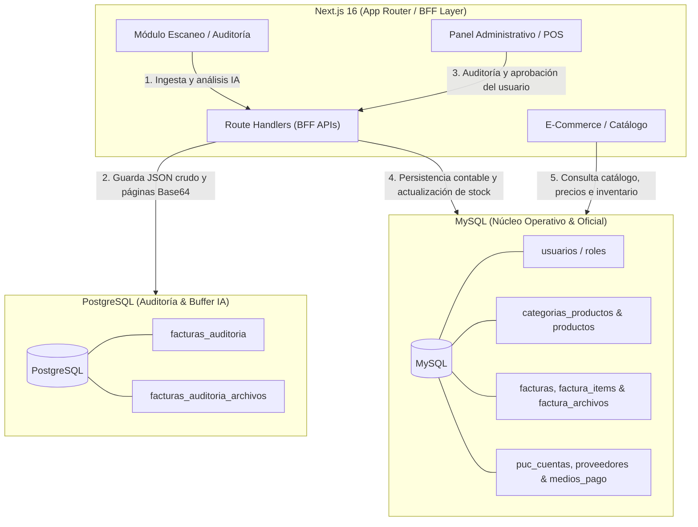
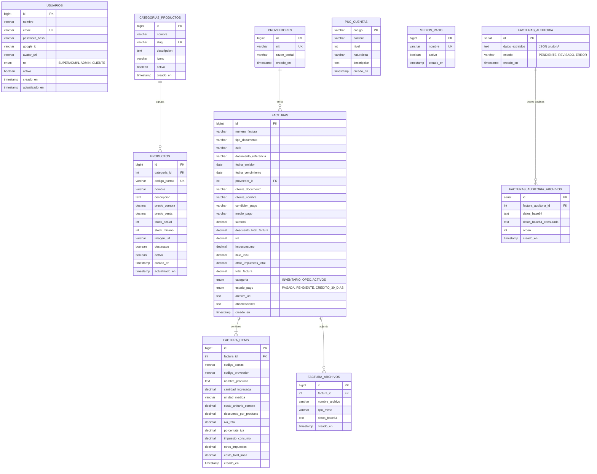

# 🗄️ 02 - Modelo de Datos (Diagrama Entidad - Relación)

El modelo de datos de **Cigarrería Megalider** implementa una arquitectura **Multi-Base de Datos** mediante [Drizzle ORM](https://orm.drizzle.team/), desacoplando las responsabilidades transaccionales y de negocio respecto a las cargas de trabajo de inteligencia artificial y auditoría de documentos.

---

## 🏗️ 1. Arquitectura de Datos Multi-Base de Datos

> [!NOTE]
> La persistencia se organiza en dos motores complementarios:
> - **MySQL 8.0+ (Núcleo Maestro & Negocio):** Gestiona identidades (RBAC), catálogo de productos, inventario, facturación consolidada, archivos oficiales y el Plan Único de Cuentas (PUC).
> - **PostgreSQL 15+ (Buffer & Auditoría IA):** Actúa como almacén de ingestión transitorio para capturar payloads crudos de escaneo por IA y almacenar las imágenes de páginas antes y después de censura.

---

## 🗂️ 2. Diagrama Entidad - Relación (Mermaid ER)

El siguiente diagrama detalla la totalidad de tablas, atributos, tipos de datos y relaciones foráneas definidas en el esquema Drizzle (`lib/db/mysql/schema.ts` y `lib/db/postgres/schema.ts`):

---

## 📝 3. Diccionario de Tablas y Esquemas

### 3.1 Base de Datos MySQL (`lib/db/mysql/schema.ts`)

#### 👤 Dominio: Usuarios y Autenticación
- **`usuarios`**: Almacena las cuentas tanto para personal interno con acceso administrativo como para clientes de la tienda online.
  - Campos clave: `email` (UK), `rol` (`SUPERADMIN`, `ADMIN`, `CLIENTE`), `password_hash`, `google_id` (para OAuth 2.0).

#### 📦 Dominio: Catálogo e Inventario
- **`categorias_productos`**: Familias taxonómicas de productos (Licores, Cigarrillos, Bebidas, Confitería, etc.).
  - Campos clave: `slug` (UK para URLs amigables), `activo`.
- **`productos`**: Catálogo comercial y control de existencias.
  - Campos clave: `categoria_id` (FK a `categorias_productos`), `codigo_barras` (UK), `precio_compra`, `precio_venta`, `stock_actual`, `stock_minimo`.

#### 🧾 Dominio: Facturación y Compras
- **`proveedores`**: Terceros y distribuidores de mercancía.
  - Campos clave: `nit` (UK), `razon_social`.
- **`facturas`**: Cabecera contable y comercial de facturas de compra/inventario.
  - Campos clave: `numero_factura`, `proveedor_id` (FK), `cufe`, `total_factura`, desgloses impositivos (`iva`, `impoconsumo`, `ibua_ipcu`), `estado_pago`.
- **`factura_items`**: Líneas de detalle de cada producto contenido en la factura con su denominación comercial (`nombre_producto`).
  - Campos clave: `factura_id` (FK), `nombre_producto`, `cantidad_ingresada`, `costo_unitario_compra`, `costo_total_linea`, `iva_total`.
- **`factura_archivos`**: Soporte digitalizado de la factura en formato Base64 persistido de forma oficial.
  - Campos clave: `factura_id` (FK), `nombre_archivo`, `tipo_mime`, `datos_base64`.

#### 📚 Dominio: Maestro Contable
- **`puc_cuentas`**: Catálogo del Plan Único de Cuentas para causación y parametrización contable.
  - Campos clave: `codigo` (PK alfanumérico), `nombre`, `nivel`, `naturaleza` (Débito/Crédito).
- **`medios_pago`**: Métodos autorizados de pago (Efectivo, Transferencia, Tarjeta, Crédito 30 días).

---

### 3.2 Base de Datos PostgreSQL (`lib/db/postgres/schema.ts`)

#### 🤖 Dominio: Ingestión y Auditoría con IA
- **`facturas_auditoria`**: Almacena temporalmente la extracción en formato JSON crudo generada por los modelos de visión/OCR de IA durante la captura web.
  - Campos clave: `id` (PK), `datos_extraidos` (JSON text), `estado` (`PENDIENTE`, `REVISADO`, `ERROR`).
- **`facturas_auditoria_archivos`**: Guarda los archivos e imágenes de cada página escaneada, junto con su versión censurada (si el operador cubrió datos confidenciales).
  - Campos clave: `factura_auditoria_id` (FK con cascada), `datos_base64`, `datos_base64_censurada`, `orden`.

> [!IMPORTANT]
> **Ciclo de Vida de los Datos:** Una vez que el usuario revisa y aprueba los datos en el módulo de auditoría de facturas, la información se transforma en registros consolidados en MySQL (`facturas`, `factura_items`, `factura_archivos`) y actualiza el inventario en `productos`.

---

## 🔗 Referencias Relacionadas
- 🏛️ [Arquitectura General del Sistema](./01-Arquitectura-General.md)
- 🔄 [Flujos de Autenticación](./03-Flujos-de-Autenticacion.md)
- 🛡️ [Patrones de Arquitectura y Estado](./05-Patrones-de-Arquitectura.md)
- 📑 [Índice de Diseño](./README.md)
