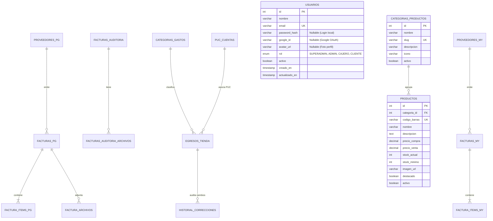

# 🗄️ 02 - Modelo de Datos (Diagrama Entidad - Relación)

El modelo de datos de Cigarrería Megalider combina estructuras relacionales distribuidas entre PostgreSQL (contabilidad) y MySQL (usuarios y catálogo de productos).

---

## 🗄️ Diagrama Entidad - Relación (Mermaid ER)

---

## 📋 Descripción de Tablas Principales

### 1. Base de Datos MySQL (`usuarios`, `catálogo` y `financiero`)
- **`usuarios`:** Almacena los datos de identidad. El campo `google_id` permite la autenticación federada. El campo `rol` delimita los permisos de acceso.
- **`categorias_productos`:** Clasifica el inventario en las categorías oficiales (Licores, Cigarrillos y Vapeo, Confitería y Snacks, Bebidas).
- **`productos`:** Catálogo detallado de productos con código de barras, precios de compra/venta y control de stock mínimo.
- **`proveedores`, `facturas` & `factura_items`:** (NUEVO) Consolidación financiera de facturas aprobadas vinculadas a proveedores, para gestión general de inventario, OPEX y activos.

### 2. Base de Datos PostgreSQL (`cmegalider` / Contabilidad y Hermes IA)
- **`proveedores`, `facturas` & `factura_items`:** Registra las compras de mercancía procesadas por Hermes IA, con desglose exhaustivo de impuestos (IVA, Impoconsumo, IBUA/IPCU), CUFE y retenciones para cuadre contable.
- **`factura_archivos`:** (NUEVO) Almacena los documentos (PDF/Imágenes en Base64) originales vinculados a las facturas procesadas.
- **`facturas_auditoria` & `facturas_auditoria_archivos`:** (NUEVO) Registros temporales de facturas escaneadas por la IA pendientes de revisión/auditoría manual, con soporte para versiones censuradas.
- **`egresos_tienda` & `historial_correcciones`:** Registra los egresos de caja e historial de auditoría de correcciones manuales.
