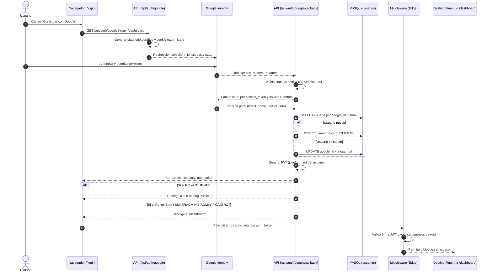

# 🔄 03 - Diagrama de Flujo: Autenticación Unificada con Google OAuth 2.0 y RBAC

El sistema utiliza un flujo unificado de autenticación que soporta credenciales locales y Google OAuth 2.0, aplicando enrutamiento dinámico según el rol del usuario.

---

## 🔄 Diagrama de Secuencia (Mermaid)

---

## 🛡️ Reglas de Enrutamiento por Rol (RBAC)

1. **`SUPERADMIN` & `ADMIN`:** Acceso total al Dashboard (`/dashboard`), Contabilidad (`/contabilidad/*`), Auditoría e Inventario.
2. **`CAJERO`:** Acceso a Dashboard básico y consulta de facturas/egresos sin permisos de eliminación.
3. **`CLIENTE`:** Redirección automática a la Landing Pública (`/`). Bloqueo estricto por Middleware Edge si intenta ingresar a `/dashboard` o `/contabilidad`.
