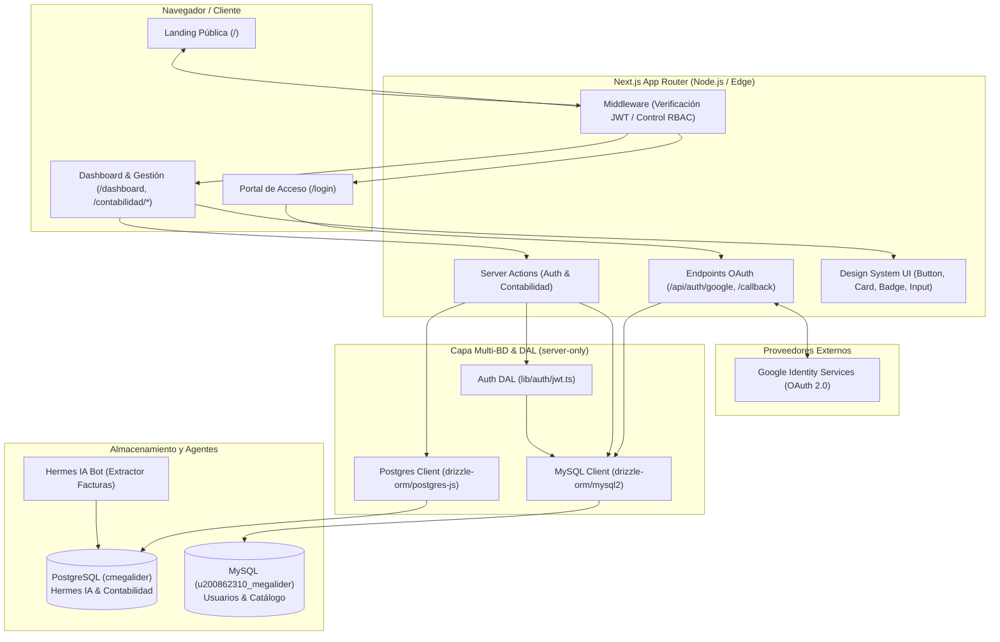
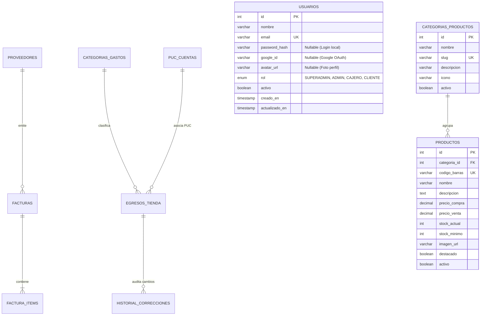
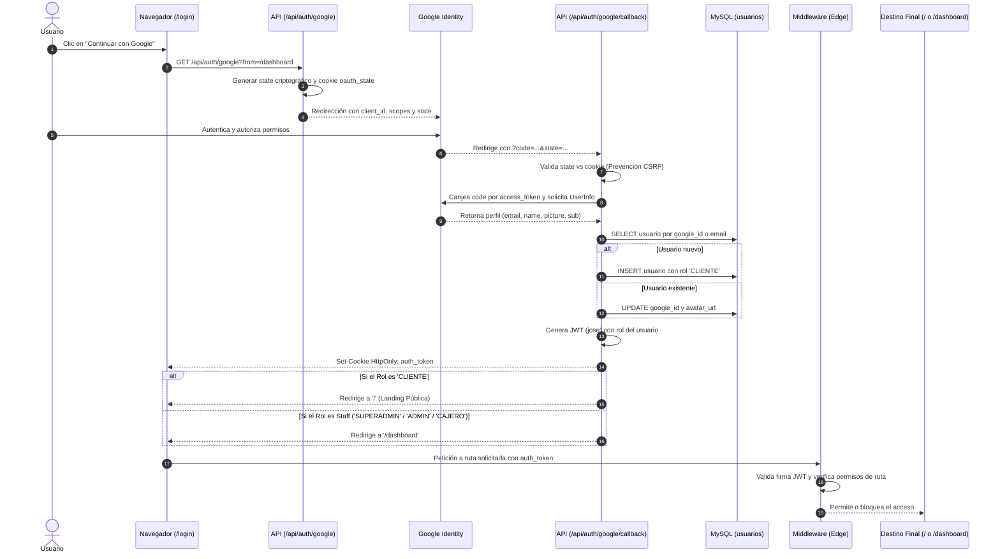

# 02 - Documentos de Diseño y Arquitectura

Este directorio contiene la arquitectura del sistema, diagramas de flujo, modelo de datos y lineamientos visuales de **Cigarrería Megalider**.

---

## 🏛️ 1. Arquitectura General del Sistema



---

## 🗄️ 2. Modelo de Datos (Diagrama Entidad - Relación)



---

## 🔄 3. Diagrama de Flujo: Autenticación Unificada con Google OAuth 2.0 y RBAC



---

## 🎨 4. Lineamientos de Marca y Paleta de Colores

| Tono / Rol | Código Hex | Aplicación en la Interfaz |
| :--- | :--- | :--- |
| **Verde Esmeralda Oscuro** | `#067335` | Color primario, logotipos, títulos serif y barras principales. |
| **Verde Acción (CTA)** | `#038C3E` | Botones de acción principal (`Button variant="primary"`), estados activos. |
| **Verde Medio** | `#53A677` | Bordes sutiles, detalles de branding y líneas secundarias. |
| **Menta Suave** | `#A7D9BD` | Badges de estado (`Badge variant="mint"`), fondos de iconos y acentos. |
| **Fondo Claro / Neutro** | `#F2F2F2` | Fondo de página general, tarjetas secundarias y contraste limpio. |

### Tipografía
* **Títulos y Encabezados:** `Playfair Display` (serif elegante y tradicional).
* **Textos e Interfaz:** `Plus Jakarta Sans` (sans-serif moderna y altamente legible).

---

## 🛡️ 5. Patrón Data Access Layer (DAL) & Cache Components

Para cumplir con la arquitectura de **Cache Components**:

1. **Aislamiento Seguro (`server-only`):** La lógica de validación criptográfica y tokens en [`lib/auth/jwt.ts`](../../lib/auth/jwt.ts) está encapsulada para evitar que cualquier secreto o helper llegue al bundle del navegador.
2. **Push Dynamic Access Down (Streaming no bloqueante):** Los `layouts` no ejecutan llamadas bloqueantes a `cookies()` en su raíz. Las lecturas dinámicas se delegan a componentes específicos envueltos en `<Suspense>`, permitiendo que el shell estático se transmita de forma instantánea al cliente.
3. **Data Transfer Objects (DTO):** Las respuestas y sesiones solo exponen campos públicos (`id`, `nombre`, `email`, `rol`, `avatarUrl`), garantizando que datos sensibles como `password_hash` nunca sean transferidos al cliente.

---

## 🔌 6. Arquitectura Backend for Frontend (BFF)

El patrón BFF en Next.js desacopla la UI de los servicios y bases de datos internos:

```
[Cliente Web / Móvil / Agentes IA]
              │
    (HTTPS / REST / OAuth)
              ▼
┌──────────────────────────────────────────────┐
│       Next.js App Router (BFF Layer)         │
│  - Route Handlers (`app/api/**/route.ts`)    │
│  - Middleware / Proxy (`middleware.ts`)      │
│  - Negociación de Contenido (`Vary: Accept`) │
│  - Sanitización & Validación de Esquema      │
└──────┬───────────────────────────────┬───────┘
       │                               │
       ▼                               ▼
 [PostgreSQL: Hermes IA]      [MySQL: Tienda & Usuarios]
```

- **Regla de Separación:** Los Server Components leen directamente de las capas de base de datos (`lib/db/`), mientras que los Route Handlers atienden peticiones externas, OAuth, webhooks y clientes que requieren formatos específicos (JSON, XML, Markdown).

---

## ⚡ 7. Estrategia de Lazy Loading & Optimización de Bundle

1. **Server Components por Defecto:** Se dividen automáticamente en fragmentos (*code-splitting*) en el servidor y se transmiten mediante *streaming*.
2. **Client Components Bajo Demanda (`next/dynamic`):**
   - Modales (verificación de edad, filtros avanzados, drawers de carrito).
   - Componentes interactivos dependientes de APIs de navegador con `{ ssr: false }` exclusivo en Client Components.
   - Placeholders visuales (`loading: () => <Skeleton />`) para garantizar estabilidad visual (CLS = 0).
3. **Librerías Externas (`import()` dinámico):** Carga en diferido de herramientas pesadas (búsqueda difusa `fuse.js`, generadores de recibos PDF, exportadores Excel) solo al desencadenar la acción.

---

## 📈 8. Medición de Rendimiento y Core Web Vitals

- **Límites de Cliente Aislados:** Telemetría instrumentada en componentes cliente dedicados (`useReportWebVitals`) sin convertir páginas o layouts en Client Components.
- **Envío No Bloqueante:** Uso prioritario de `navigator.sendBeacon()` o `fetch(..., { keepalive: true })` para garantizar la entrega de métricas sin impactar el hilo principal de renderizado.
