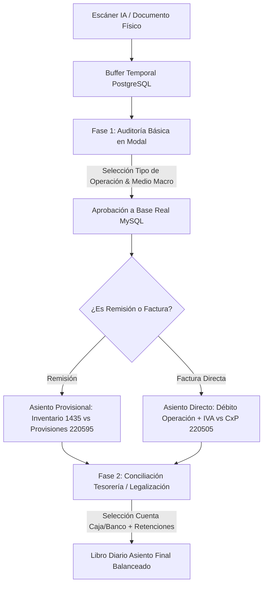
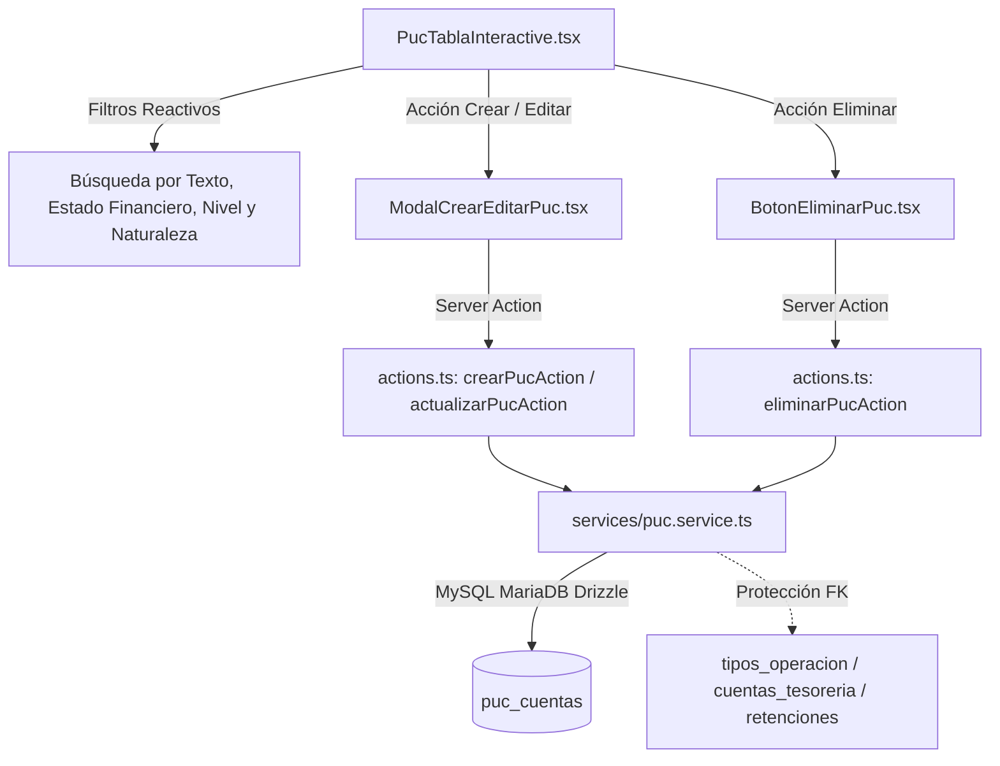
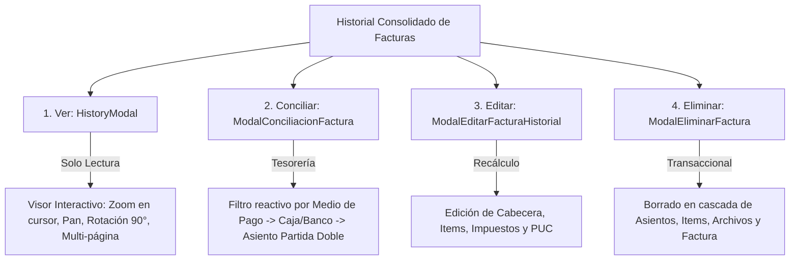

# 📄 05 - Módulo de Contabilidad, Tesorería y Facturación

Este documento detalla la arquitectura técnica, modelo de datos, motor de partida doble, catálogo PUC, gestión de medios de pago y cuentas de tesorería, auditoría tributaria y ciclo de vida de facturas y remisiones para **Cigarrería Megalider**.

---

## 🏛️ 1. Arquitectura y Fundamento Contable (NIIF Colombia)

El módulo contable sigue las directrices del **Plan Único de Cuentas (PUC)** comercial colombiano y las normas **NIIF para Pymes**:

1. **Dinámica de Partida Doble Rigurosa:** Cada transacción genera registros en el libro diario (`factura_asientos`) donde se verifica estrictamente que $\sum \text{Débitos} \equiv \sum \text{Créditos}$.
2. **Desacoplamiento en 2 Fases:**
   - **Fase 1 (Auditoría Básica Ágil):** Ingesta universal desde escáner de IA (Factura Electrónica, POS, Remisión, Documento Soporte). Validación de proveedor, ítems, totales matemáticos, Medio de Pago Macro y Tipo de Operación.
   - **Fase 2 (Conciliación Post-Aprobación en Tesorería):** Selección de la cuenta específica de caja/banco (`cuentas_tesoreria`), aplicación de retenciones fiscales (RteFte, ReteIVA, ReteICA) y generación automática del asiento contable balanceado.
3. **Manejo Especial de Remisiones:** Registro contable transitorio contra provisión de pasivo (`220595`) sin afectar cuentas por pagar comerciales definitivas (`220505`) hasta su legalización con Factura Electrónica.



---

## 🗄️ 2. Modelo de Datos y Tablas Contables (MySQL)

### 2.1 Tablas Maestras
* **`puc_cuentas`**: Catálogo jerárquico de cuentas contables (Clases 1 a 9 NIIF).
* **`tipos_operacion`**: Define el destino económico del gasto o activo, la cuenta PUC débito/crédito, y si afecta stock o si es remisión.
  - `COMPRA_MERCANCIA`: Débito `143505`, Crédito `220505`, `afecta_inventario = true`.
  - `COMPRA_ACTIVO_FIJO`: Débito `152805`, Crédito `220505`, `afecta_inventario = false`.
  - `MANTENIMIENTO_LOCAL`: Débito `514510`, Crédito `233595`, `afecta_inventario = false`.
  - `SERVICIOS_PUBLICOS`: Débito `513525`, Crédito `233595`, `afecta_inventario = false`.
  - `REMISION_COMPRA`: Débito `143505`, Crédito `220595`, `es_remision = true`.
* **`medios_pago`**: Clasificación Macro (Efectivo, Transferencia, Tarjeta Datáfono, Crédito 30 días).
* **`cuentas_tesoreria`**: Subcuentas auxiliares reales asociadas a un medio macro y a una cuenta PUC (ej. *Caja Mostrador 1* $\rightarrow$ `11050501`, *Bancolombia* $\rightarrow$ `11100501`, *Nequi* $\rightarrow$ `11100502`).
* **`tipos_retencion`**: Catálogo de retenciones fiscales (RteFte Compras 2.5%, RteFte Servicios 3.5%, ReteIVA 15%, ReteICA).
* **`factura_retenciones`**: Retenciones deducidas aplicadas a cada factura.
* **`factura_asientos`**: Libro diario oficial de partida doble generado por la factura o su pago.

---

## 🗂️ 3. Catálogo del Plan Único de Cuentas (PUC) (`app/(admin)/contabilidad/puc`)

El módulo del catálogo PUC gestiona la estructura contable base del sistema, permitiendo parametrizar las cuentas que sustentan las compras, inventarios, tesorería, retenciones y libro diario.



### 3.1 Estructura Jerárquica y Clasificación NIIF
Implementada en [`lib/puc-utils.ts`](file:///c:/Users/BrianKrou/OneDrive/Documentos/PROYECTOS%20-%20JBone/Megalider/pagina-web-megalider/lib/puc-utils.ts):
- **Cálculo Automático de Nivel (`calcularNivelPuc`):**
  - **Nivel 1 (1 dígito):** Clase (ej. `1` Activo).
  - **Nivel 2 (2 dígitos):** Grupo (ej. `11` Disponible).
  - **Nivel 3 (4 dígitos):** Cuenta (ej. `1105` Caja).
  - **Nivel 4 (6 dígitos):** Subcuenta (ej. `110505` Caja General).
  - **Nivel 5 (>6 dígitos):** Auxiliar (ej. `11050501` Caja Sede Principal).
- **Mapeo de Clases 1 a 9 (`CLASES_PUC_MAP`):**
  - **Balance General:** Clase 1 (Activo - Débito), Clase 2 (Pasivo - Crédito), Clase 3 (Patrimonio - Crédito).
  - **Estado de Resultados:** Clase 4 (Ingresos - Crédito), Clase 5 (Gastos - Débito), Clase 6 (Costos de Ventas - Débito), Clase 7 (Costos de Producción - Débito).
  - **Cuentas de Orden:** Clase 8 (Deudoras - Débito), Clase 9 (Acreedoras - Crédito).
- **Valores Canónicos de Naturaleza Contable:**
  - Persistencia estandarizada en MySQL bajo las cadenas literales canónicas **`"Débito"`** y **`"Crédito"`**.
  - Función de normalización tolerante (`normalizarNaturalezaPuc`) que acepta y convierte formatos legados (`"D"`, `"C"`, `"DEBITO"`, etc.) y auto-sugiere la naturaleza contable según el primer dígito del código PUC.

### 3.2 Componentes y Servicios
1. **`page.tsx` (Server Component):** Carga inicial de cuentas con `getPucCuentas()`, breadcrumb y cabecera corporativa.
2. **`PucTablaInteractive.tsx` (Client Component):**
   - Filtrado reactivo en memoria (búsqueda normalizada insensible a tildes y mayúsculas).
   - Filtro por Tipo de Estado Financiero (`BALANCE_GENERAL`, `ESTADO_RESULTADOS`, `CUENTAS_DE_ORDEN`).
   - Badges visuales semánticos de Clase, Nivel y Naturaleza Contable (Débito/Crédito).
3. **`ModalCrearEditarPuc.tsx`:** Formulario interactivo con autocalculador dinámico de nivel al teclear el código numérico y selector de naturaleza contable explicativo.
4. **`BotonEliminarPuc.tsx`:** Modal de confirmación de borrado con alerta de impacto.
5. **`actions.ts` & `services/puc.service.ts`:**
   - Validación Zod estricta (`/^[0-9]+$/` de 1 a 10 dígitos).
   - Persistencia segura con Drizzle ORM (`dbMysql.insert(schemaMysql.pucCuentas).values(...)`).
   - Captura de errores de clave foránea (`ER_ROW_IS_REFERENCED`) para proteger la integridad referencial si la cuenta está en uso en otros módulos.
   - Revalidación automática con `revalidatePath("/contabilidad/puc")`.

---

## ⚙️ 4. Motor de Asientos Contables (`lib/contabilidad/motor-asientos.ts`)

La función `generarAsientoCompra()` implementa el cálculo determinístico:

$$\text{Valor a Pagar / CxP} = \text{Subtotal} + \text{IVA} + \text{Impoconsumo} + \text{Otros Impuestos} - \text{Retenciones}$$

```typescript
// Regla de Oro Contable
const totalDebitos = lineas.reduce((acc, l) => acc + Number(l.debito), 0);
const totalCreditos = lineas.reduce((acc, l) => acc + Number(l.credito), 0);

if (Math.abs(totalDebitos - totalCreditos) > 0.01) {
  throw new Error(`Asiento descuadrado: Débitos ($${totalDebitos}) !== Créditos ($${totalCreditos})`);
}
```

---

## 🖥️ 5. Arquitectura de Interfaces y Modales del Historial (`app/(admin)/facturas/history/page.tsx`)

El módulo del historial consolida las operaciones de auditoría mediante 4 acciones dedicadas e independientes por cada factura:



### 5.1 Componentes de Gestión Contable

1. **`HistoryModal.tsx` (Visor de Inspección de Solo Lectura)**:
   - Visor de imagen de factura con soporte multi-página (`factura_archivos` y `archivo_url` `LONGTEXT`).
   - Zoom interactivo con rueda del ratón centrado en el punto del cursor (`onWheel`), arrastre/pan (`onMouseDown`/`onMouseMove`), doble clic de aumento rápido y rotación incremental de 90° (`rotate(90deg)`).
   - Pestaña de **Detalle de Compra** con datos de emisor, items, base gravable e impuestos.
   - Pestaña de **Libro Diario (NIIF)** con detalle de partidas débitos y créditos registradas.

2. **`ModalConciliacionFactura.tsx` (Cierre y Asignación de Tesorería)**:
   - **Filtro reactivo por Medio de Pago**: Píldoras interactivas (*Todos*, *Efectivo*, *Transferencia*, *Billeteras Digitales*, *Tarjetas*) que filtran en tiempo real el desplegable de cajas y bancos.
   - **Asignación de Cuentas de Tesorería**: Cajas registradoras (`110505`) o Cuentas Bancarias (`111005`).
   - **Retenciones en la Fuente**: Selección de tarifas aplicables (RteFte Compras, Servicios, ReteIVA, ReteICA).
   - **Previsualización de Partida Doble**: Verificación matemática en vivo de $\sum \text{Débitos} \equiv \sum \text{Créditos}$.

3. **`ModalEditarFacturaHistorial.tsx` (Modificación y Recálculo)**:
   - Permite editar información fiscal, clasificación de tipo de operación, medio de pago y detalle de productos.
   - Recálculo dinámico en tiempo real de subtotales, IVA 5%, IVA 19%, Impoconsumo, otros impuestos y total final.

4. **`ModalEliminarFactura.tsx` (Eliminación Segura)**:
   - Proceso transaccional en MariaDB que elimina en cascada: `factura_asientos`, `factura_retenciones`, `factura_items`, `factura_archivos` y la factura principal.

5. **`ModalDocumentoSoporte.tsx` (Compras y Salidas de Dinero sin Factura)**:
   - Permite registrar adquisiciones a comerciantes informales, campesinos o prestadores no obligados a facturar.
   - Genera un consecutivo oficial interno (`DS-XXXX`), registra el proveedor informal con cédula/NIT, agrega los ítems de mercancía afectando el stock de productos, y genera automáticamente el asiento contable balanceado (Débito `143505` Inventario vs Crédito `110505` Caja o `220505` Cuentas por Pagar).

---

## 🔄 6. Ciclo de Vida de Estados Contables y Compras a Crédito

### 6.1 Matriz de Estados
| Estado Contable | Cuenta Crédito Principal | Condición de Tesorería | Estado de Pago |
| :--- | :--- | :--- | :--- |
| **`CONCILIADA`** | `110505` (Caja) o `111005` (Bancos) | Cuenta de tesorería asignada | `PAGADA` |
| **`PENDIENTE_CONCILIACION`** | `220505` (Proveedores Nacionales) | Sin cuenta de tesorería ("Ninguna") | `PENDIENTE` (Crédito) |

### 6.2 Flujo de Facturas a Crédito y Pago Posterior
1. **Momento 1 (Causación)**: Al aprobar o registrar la factura a crédito, se deja la cuenta de tesorería en `— Ninguna —`. El sistema acredita la cuenta `220505` (Proveedores Nacionales), quedando en estado `PENDIENTE_CONCILIACION` y `PENDIENTE`.
2. **Momento 2 (Cancelación/Pago Días Después)**: Desde el Historial (`/facturas/history`), se presiona el botón **Conciliar (`Scale`)**, se selecciona la Caja o Banco desembolsado y la fecha de pago. El sistema actualiza el asiento contable acreditando la cuenta de tesorería (`110505`/`111005`) y transiciona el estado a `CONCILIADA` y `PAGADA`.

> [!IMPORTANT]
> El filtro de **Estado Contable** en el Historial (`/facturas/history`) evalúa estrictamente `estadoContable = 'CONCILIADA'` o `estadoContable = 'PENDIENTE_CONCILIACION'`, garantizando consistencia absoluta entre los reportes de libro diario y las cuentas por pagar.
