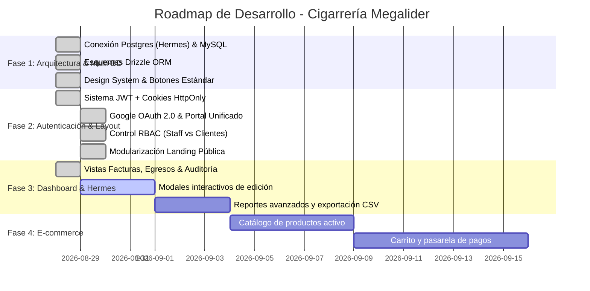

# 📅 01 - Roadmap y Cronograma de Fases

El cronograma de desarrollo del proyecto Cigarrería Megalider se organiza en 4 fases secuenciales.

---

## 📅 Diagrama de Gantt (Mermaid)

```mermaid
gantt
    title Roadmap de Desarrollo - Cigarrería Megalider
    dateFormat  YYYY-MM-DD
    section Fase 1: Arquitectura & Multi-BD
    Conexión Postgres (Hermes) & MySQL  :done, 2026-08-28, 1d
    Esquemas Drizzle ORM                :done, 2026-08-28, 1d
    Design System & Botones Estándar    :done, 2026-08-28, 1d
    section Fase 2: Autenticación & Layout
    Sistema JWT + Cookies HttpOnly      :done, 2026-08-28, 1d
    Google OAuth 2.0 & Portal Unificado :done, 2026-08-29, 1d
    Control RBAC (Staff vs Clientes)    :done, 2026-08-29, 1d
    Modularización Landing Pública      :done, 2026-08-29, 1d
    section Fase 3: Dashboard & Hermes
    Vistas Facturas, Egresos & Auditoría :done, 2026-08-28, 1d
    Modales interactivos de edición      :active, 2026-08-29, 3d
    Reportes avanzados y exportación CSV :2026-09-01, 3d
    section Fase 4: E-commerce
    Catálogo de productos activo         :2026-09-04, 5d
    Carrito y pasarela de pagos          :2026-09-09, 7d
```
