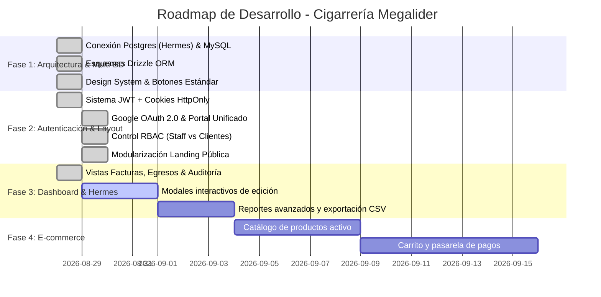

# 04 - Gestión del Proyecto y Cronograma

Este directorio almacena el cronograma de ejecución, el seguimiento de fases, el estado de los entregables y los reportes de progreso de **Cigarrería Megalider**.

---

## 📅 Cronograma y Roadmap de Fases

---

## 📊 Estado de los Entregables

| Entregable | Módulo / Área | Estado | Observaciones |
| :--- | :--- | :--- | :--- |
| **Landing Pública** | Frontend Público | ✅ Completado | Separado en Navbar, Footer y 4 secciones independientes con botón de acceso activo. |
| **Integración Hermes IA** | Backend Postgres | ✅ Completado | Conexión en tiempo real con facturas, items y egresos. |
| **Portal Unificado de Auth** | Seguridad / Auth | ✅ Completado | Login unificado con credenciales y Google OAuth 2.0 integrado con MySQL. |
| **Control de Acceso RBAC** | Seguridad / Edge | ✅ Completado | Separación de roles: Staff (`SUPERADMIN`, `ADMIN`, `CAJERO`) al Dashboard, `CLIENTE` a Inicio (`/`). |
| **Design System UI** | Frontend UI | ✅ Completado | Componentes `Button`, `Input`, `Card`, `Badge` estandarizados. |
| **Skills de IA & Coding Standards** | Ecosistema / Agentes | ✅ Completado | 6 skills implementadas (`nextjs-coding`, `megalider-brand`, `token-optimization`, `nextjs-analytics`, `nextjs-lazy-loading`, `nextjs-bff`). |
| **Auditoría Next.js 16+** | Calidad / Build | ✅ Completado | Compilación Turbopack exitosa (11/11 rutas) y cero errores TypeScript. |
| **Modales de Corrección** | Contabilidad | ⏳ En Progreso | Interfaz para editar egresos y registrar motivo en auditoría. |
| **Catálogo E-commerce** | Catálogo / Tienda | 📅 Planificado | CRUD de productos y sincronización de stock. |

---

## 📝 Resumen de Actas y Decisiones Clave

1. **Portal Unificado con Redirección Inteligente RBAC:** Se unificó el inicio de sesión para todo tipo de usuarios en `/login`, garantizando que cualquier usuario externo que se registre mediante Google reciba el rol de menor privilegio (`CLIENTE`) y sea enviado a la tienda pública (`/`), protegiendo de forma transparente el acceso al panel administrativo.
2. **Decisión Multi-BD:** Se optó por **Drizzle ORM** para permitir consultas simultáneas a PostgreSQL (Hermes) y MySQL (tienda) sin generar sobrecarga ni múltiples binarios.
3. **Estrategia de Auditoría:** Se vinculó el flujo de edición a la tabla existente `historial_correcciones` para garantizar que nunca se sobreescriba un dato de Hermes sin dejar registro del valor anterior y el responsable.
4. **Adopción de AI Coding Standards:** Se formalizaron skills de agentes para garantizar que cualquier desarrollo futuro respete los contratos de marca, patrones BFF, lazy loading y optimización de contexto.
